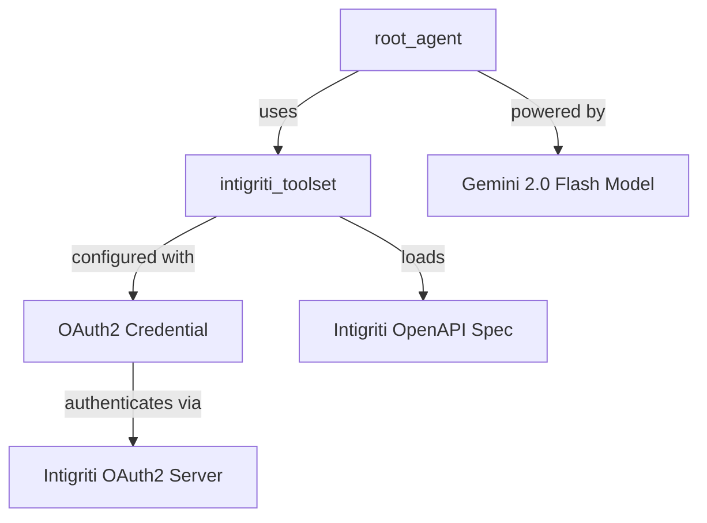
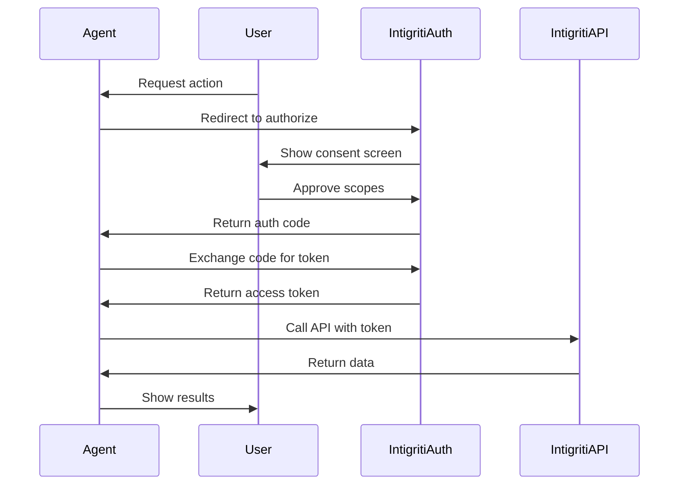

# Intigriti Agent

## Development

Run the cyber intel agent programmatically:

```bash
cd agents
 uv run -m intigriti_agent.cyber_intel_client
```

Run the cyber intel agent as an a2a server:

```bash
cd agents
uv run -m intigriti_agent.a2a_server
```

Request the agent card from the locally running server:

```bash
curl http://localhost:10004/.well-known/agent.json | jq
```

## Architecture

### Component



### Sequence Diagram for OAuth Flow


