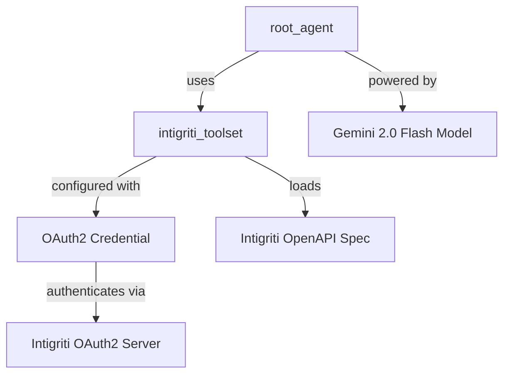
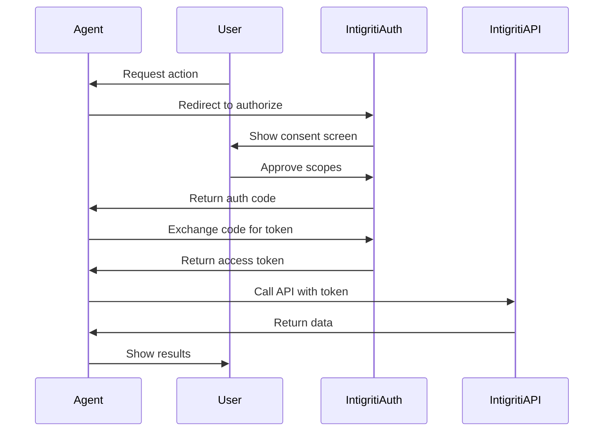

# Agent Architecture

## Component

```mermaid
graph TB
    A[root_agent] -->|uses| B[intigriti_toolset]
    B -->|configured with| C[OAuth2 Credential]
    B -->|loads| D[Intigriti OpenAPI Spec]
    C -->|authenticates via| E[Intigriti OAuth2 Server]
    A -->|powered by| F[Gemini 2.0 Flash Model]
```

## Sequence Diagram for OAuth Flow

```mermaid
sequenceDiagram
    participant Agent
    participant User
    participant IntigritiAuth
    participant IntigritiAPI

    User->>Agent: Request action
    Agent->>IntigritiAuth: Redirect to authorize
    IntigritiAuth->>User: Show consent screen
    User->>IntigritiAuth: Approve scopes
    IntigritiAuth->>Agent: Return auth code
    Agent->>IntigritiAuth: Exchange code for token
    IntigritiAuth->>Agent: Return access token
    Agent->>IntigritiAPI: Call API with token
    IntigritiAPI->>Agent: Return data
    Agent->>User: Show results
```
